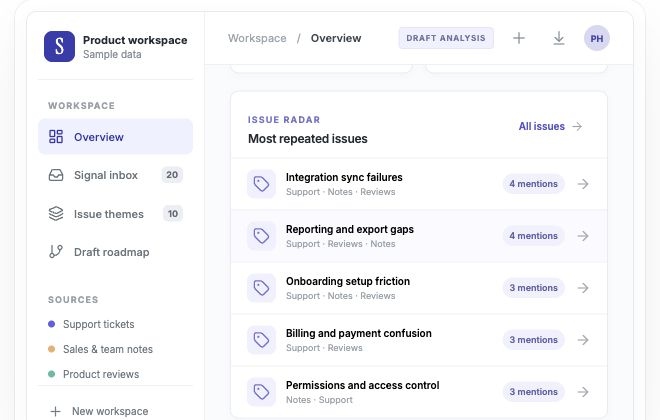

# Signal to Roadmap

Turn scattered customer feedback into inspectable product decisions.



**[Open the portfolio demo](https://poojahegdeportfolio.netlify.app/apps/signal-to-roadmap/)** · [Read the dashboard setup guide](dashboard/README.md)

## What the dashboard does

- Accepts pasted support tickets, sales or team notes, and product reviews. Mixed entries can be prefixed `support:`, `note:`, or `review:`. CSV and TXT import are supported.
- Groups recurring problems into named issues, shows how many input records mention each one, and keeps the original customer wording linked to the group.
- Scores themes from repeat frequency, source diversity, and blocking language. The score is a planning aid, not a decision made for the team.
- Suggests product initiatives in **Now / Next / Later** lanes. A reviewer can rename an issue, move its lane, hide a weak theme, inspect evidence, and export a Markdown roadmap draft.
- Saves the workspace in the browser. The included sample data is synthetic, and a blank workspace is available.

## Run locally

Requires Node.js 22 or newer and pnpm 11 or newer.

```bash
cd dashboard
pnpm install
pnpm dev
```

Open the URL printed by Vite. To create a static bundle, run `pnpm build` from `dashboard/` and deploy its `dist/` directory.

## Method and limits

The runnable dashboard analyzes data locally with a transparent issue taxonomy and a word-similarity fallback for unfamiliar topics. It does **not** call an AI API, and it does not send imported feedback to a server. New or ambiguous themes should be renamed or reviewed before a roadmap decision. A repeat count is a count of input records, not unique customers. The priority score does not know revenue, effort, or strategic fit.

The earlier experimental Python/Next.js code remains under `backend/` and `frontend/`; the working product demo is in `dashboard/`.
